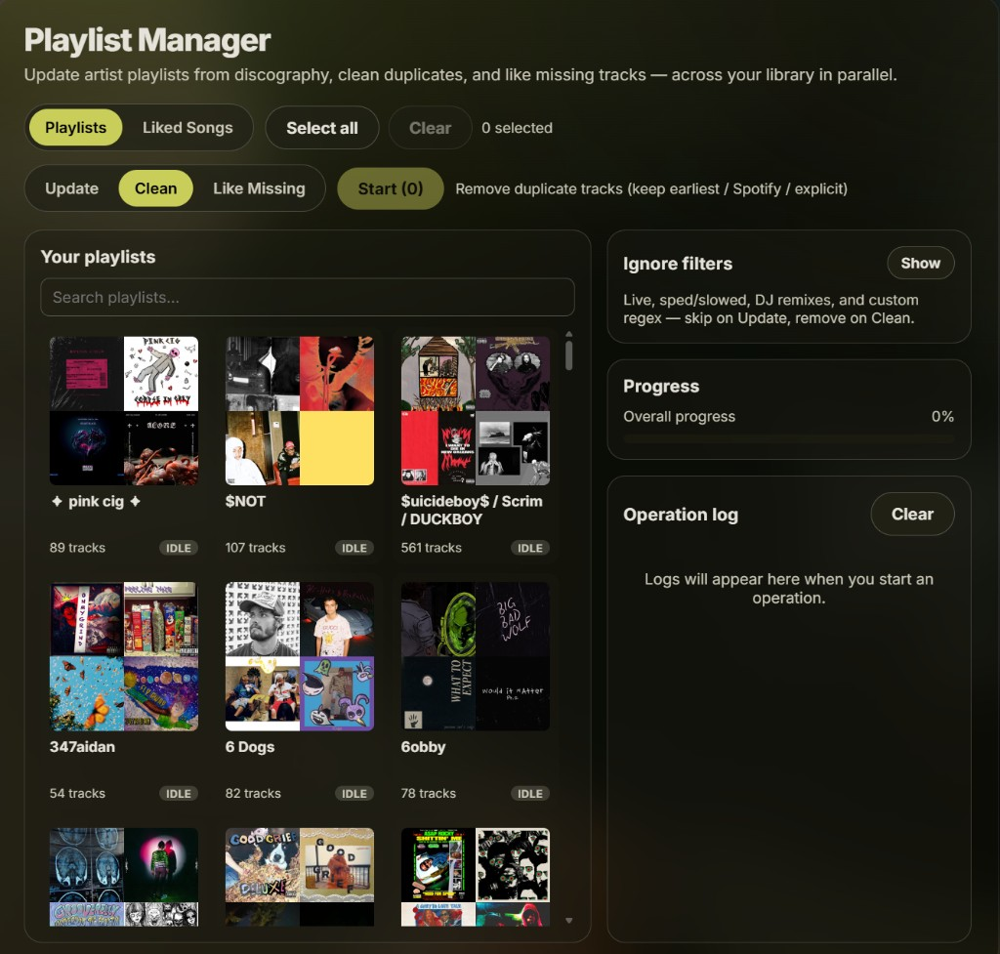

# Playlist Manager

> **AI disclosure:** Substantial portions of this project were developed with AI coding assistants (Cursor / Composer and similar tools). All code was reviewed and accepted by a human maintainer, who remains responsible for its behavior. Treat this repo like any other community Spicetify app: review before you install.

Spicetify custom app to **Update** artist playlists from discography, **Clean** duplicates, and **Like Missing** tracks — with multi-playlist selection and live progress UI.

Bootstrapped with [@spicemod/creator](https://github.com/sanoojes/spicetify-creator) (formerly `@spicetify/creator`).



## Install & apply

Requires [Spicetify](https://spicetify.app/docs/getting-started) and [Bun](https://bun.sh).

```bash
git clone https://github.com/JochemKuipers/playlists-manager-app.git
cd playlists-manager-app
bun install
bun run build -- -a
```

`-a` builds, copies the app into Spicetify’s `CustomApps` folder, and runs `spicetify apply`.

Then open **Playlist Manager** in Spotify’s left sidebar.

For development with hot reload:

```bash
bun run dev
```

## Operations

| Op               | What it does                                                                                                                                               |
| ---------------- | ---------------------------------------------------------------------------------------------------------------------------------------------------------- |
| **Update**       | Reads playlist title as `Artist1 / Artist2`, fetches each artist’s discography, appends tracks not already present (URI + normalized name/duration match). |
| **Clean**        | Removes duplicate tracks. Keeps the earliest entry; prefers Spotify over local; prefers explicit when mixed. Also works on **Liked Songs**.                |
| **Like Missing** | Likes playlist tracks that are not already in Liked Songs (same name/duration skip rules).                                                                 |

### Modes

- **All playlists** — every owned playlist
- **Selection** — multi-select
- **Single** — one playlist
- **Liked Songs** — Clean only

Update playlists should be named like `Radiohead / Thom Yorke` (artists separated by `/`).

## Scripts

| Script                 | Purpose                     |
| ---------------------- | --------------------------- |
| `bun run dev`          | Watch + copy into Spicetify |
| `bun run build`        | Production bundle → `dist/` |
| `bun run build -- -a`  | Build and `spicetify apply` |
| `bun run lint`         | Biome check                 |
| `bun run update-types` | Refresh Spicetify globals   |
| `bun run clean-spice`  | Remove creator HMR helpers  |

## Layout

```text
src/
  app.tsx              # UI shell
  api/                 # Platform / GraphQL wrappers
  operations/          # update, clean, likeMissing, batch
  store/               # progress + selection state
  components/          # ModePicker, grid, progress, log
  css/app.module.scss  # Spicetify CSS variables
```
